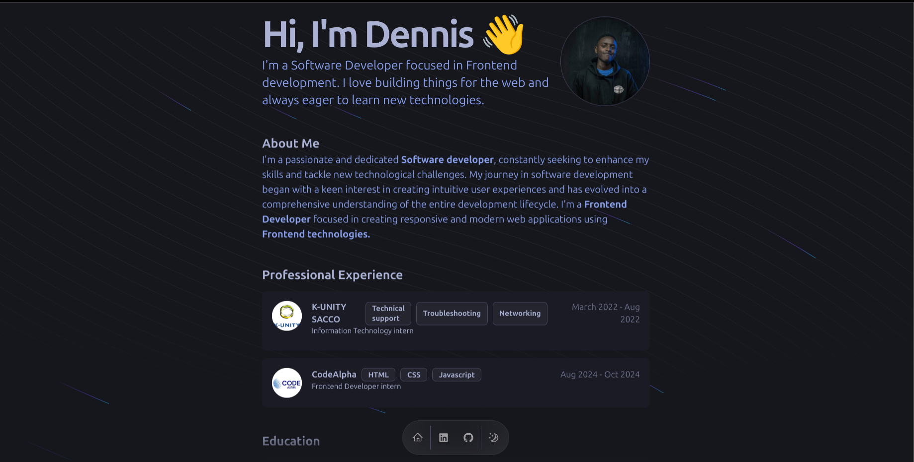

### Portfolio Overview

Welcome to my portfolio!

This collection showcases my skills and projects in **web development**.

Utilizing technologies like **React** and **TypeScript**, I aim to create seamless and engaging applications.

> Explore my work and feel free to reach out for collaborations or inquiries.

### Features

- Responsive design
- Smooth animations using Framer Motion
- Dark and light theme toggle

> To-do
>
> - Blog section implementation
> - Add more projects to the portfolio

### ScreenShot

### Technologies Used

- Next.js
- React
- TypeScript
- Tailwind CSS
- Framer Motion
- Radix UI /w Shadcn/ui

### Contact

For any assistance or collaboration, you can reach me at [renatorrodrigues2002@gmail.com](mailto:renatorrodrigues2002@gmail.com).

I'm also available on **LinkedIn**: [Renato Rocha](https://www.linkedin.com/in/renato-rrodrigues/). Feel free to connect!

---

Thank you for visiting my portfolio!
